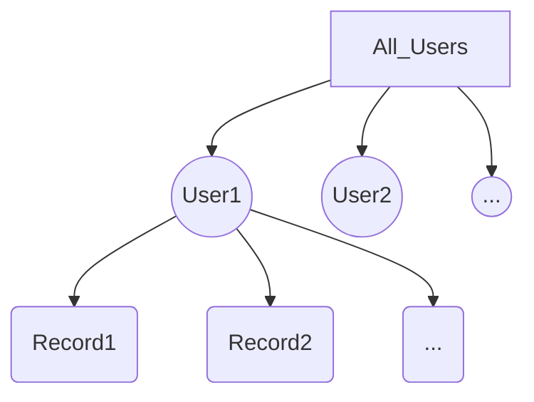

# 基于Qt与C++的俄罗斯方块游戏
作者：GoldenSea

## 问题描述

俄罗斯方块是一款经典的益智游戏，由俄罗斯的游戏设计师阿列克谢·帕吉特诺夫于 1984 年发明，很快风靡全球。这款游戏的游戏玩法非常简单，主要是要玩家控制四种由方块组成的不同形状的方块，让它们从游戏界面的顶部往下落，落到底部前组成一条完整的横向线。玩家可以操纵方块的旋转和移动，以使方块组成的横向线不断积累。如果积累的方块超出了游戏界面，游戏就会结束。

本项目利用Qt和C++复现了这一经典游戏，并且给予用户极大的自定义权限。支持设置棋盘大小，方块颜色，游戏音乐，下落速度，游戏键位等多种配置。支持多玩家存档的切换，任意游戏记录的读取和保存。提供游戏介绍页面，和排行榜功能，使用了独特的PTT(潜力值)积分算法以确保计分合理性。独创的日/夜间模式切换能够让游戏画面更加美观。

## 系统设计说明

### 数据结构说明
接下来将从窗口，游戏，存档三方面介绍数据结构

#### 窗口数据结构：
- 本软件共有5个窗口，主窗口，游戏窗口，设置窗口，加载游戏窗口，排行榜窗口，均继承 **QWidget** 类。主窗口场景创建指向剩下四个场景的指针，并且承担各个页面切换和数据交换的职能。

#### 游戏数据结构：
1.	对主体游戏而言，方块类 **Block** 是所有骨牌的抽象基类，包含骨牌的中心位置，颜色代号，各方块坐标等属性。其子类如BlockL，BlockO等七个具体方块**继承**Block并重写其构造函数，用来不同地初始化骨牌四个方块坐标。在游戏中，由基类指针Block*指向不同的子类以实现**多态**。
2.	棋盘类 **Checkerboard** 内含一个二维的QVector<QVector<int>>类型数组，用来显示“空白块”(int 0) “固定块”(int 9)和七种“移动块”(int 1-7)在游戏板上的情况，包含棋盘长宽的初始化和调整，固定块和移动块的清除，调整，刷新等行为。
3.	游戏管理类 **Gamemanager** 提供了一系列检测游戏状态的方法，如判断方块是否能移动，棋盘是否能消除，通过PTT算法计算积分增加的数字等。

#### 存档数据结构：

1.	本游戏的存档树状结构如下图所示：

2.	每一次游戏被称为一次 **记录** (Record)，其中存储着ID，世界，棋盘数组，当前块和下一个块数据，游戏是否结束，分数等数据，以结构体存储。
3.	同一个玩家的多个 **记录** 可以组成一份 **用户存档**  ，由QVector<Record>存储记录数据，其中额外记录了玩家的名字，ID信息
4.	多个玩家的 **用户存档**  组成了本游戏的 **存档文件**  ，该文件以JSON格式保存所有数据至用户的本地目录下，由全局变量存档管理者（ProfileManager）进行管理

### 任务功能说明
本程序实现了任务书中所有功能，并且创新设计了部分功能。

#### 基本要求：

1.本程序采用面向对象的思想实现，对于方块类使用了继承和多态的思想（详见游戏数据结构）。**类设计图** 如下：


本程序的类设计主要分为四部分，游戏部分，存档部分，场景部分与自定义控件。对游戏部分，Block和Checkerboard记录了方块与棋盘的物理属性与行为，Game Manager对其进行管理，并且判定游戏胜负问题与积分计算。场景部分管理不同的场景，存档部分负责游戏的存读档（详见存档数据结构），自定义控件封装了部分接口，用来更便利的设计设置界面。

#### 任务一（全部完成）：

得益于Qt方便的UI设计功能，游戏提供了友好的操作界面。在棋盘顶部能够随机产生各种方块，并通过右侧的预告板提前预告给玩家。共设置了7种不同的方块类型。
方块能自动下降，也可以手动加速下落。能通过键盘控制方块的移动和旋转并摆放在合适的位置，对于不同的棋盘大小，不会出现数组越界或者方块重叠等漏洞。当底部有被方块填满的行后，要能够及时消去对应的方块。
游戏流程图如下：

### 创新点
- 可以看到，在游戏顶部有一条【警示红线】，当方块接近顶部时，警示线会被高亮以提示用户。
- 方块消除的计分算法并非是简单的消除行数*10，为了鼓励用户连续消除多行，积分算法如下。
$$
游戏分数 =  \sum_{i=1}^{消除次数} {5}{n(n-1)}
$$
其中n为第i次消除的行数。当用户消除1行，只能得到10分，但连续消除4行，则可以得到100分。鼓励用户连续消除多行。

#### 任务二（全部完成）：

1.	本程序支持临时暂停与恢复游戏。
2.	本程序能够保存多玩家游戏进度，并能够从上次存档中恢复游戏。
### 创新点
- 本游戏在启动时，会自动在本地创建 **Json文件** (/profile.json)存储多玩家游戏进度，通过设置界面可以选择任意用户存档，在游戏加载界面可以加载该用户 **任意一次未结束的游戏记录** （点击返回按钮时提醒用户是否保存）。在本地存储的Json文件格式如下：
```JSON
[
    {
        "id": 0,
        "name": "admin",
        "record": [
            {
                "checkerboard": [] //省略
                "gamespeed": 70,
                "id": 0,
                "isGameOver": false,
                "nextblock": 1,
                "presentblock": 6,
                "score": 10,
                "time": "2023-07-10 18:16:26"
            }
        ]
    }
]
```
该存档功能具体实现详见 *存档数据结构*
#### 任务三（全部完成）：

1.本程序可以自定义游戏参数，如棋盘长宽，下落速度等。（当读取存档时，其仍然沿用该存档的游戏参数）以下是部分游戏设置场景。

2．本游戏可以用合理的方式计算分数，出具排行榜。

### 创新点
- 本游戏的用户排行榜，排名依据并不是简单的使用各次游戏分数之和，或者最高分数，考虑到不同棋盘长宽，不同下落速度对游戏难度的综合影响，本游戏采取了PTT分数计算法（仿音乐游戏Arcaea）。
- 普遍认为，棋盘越“瘦高”越简单，越“矮胖”越困难，游戏速度越快越难。因此，用户的PTT（潜力值）从最近的30次游戏计算而来，计算公式如下。
$$
用户潜力值Ptt =  \sum_{i=1}^{30} {(游戏分数+100)(游戏速度)\frac{(棋盘宽度)^2}{棋盘高度}}
$$
通过`UserProfile::getProfilePTT()`计算不同用户的潜力值，给出游戏排行榜（最多显示靠前的4名用户）。

#### 任务四（绝大部分完成，部分内容有增删）：

1. 本程序可以在主界面显示游戏规则简介，可以选择方块样式和切换背景，可播放与切换背景音乐，支持任意按键设置与快捷键设置；恢复默认设置；删除存档。
2. 设置界面主要分为四个板块：通用，图像，键盘，存档。
3. 图像界面，能够提供方块颜色的预览和设置，并且能够给出颜色的RGB代号，当颜色过暗，则为白色字体，否则为黑色。具体设置调用了QColorDialog进行颜色选择。
4. 键位设置，设置了相关函数以判断键位是否重复，若重复则会给出提醒。
5. 删除存档时，若只剩下**最后一个用户**，或者**清空存档**时，会强制用户创建一个新用户，不会出现“空用户”情况。同时该页面上方和加载游戏页面会实时显示当前用户。

### 创新点
- 本程序在切换背景时，创新性地开发了【夜间模式】，不仅改变了背景，同时字体颜色，方块颜色，棋盘颜色也作了相应的适配工作。

## 实现环境
本项目基于QtCreator5.14平台开发，设计平台为win11系统，该程序目前兼容win7，10，11等主流windows平台。本项目已经做好了打包工作，即使用户没有安装qt环境也可以顺利运行。同时本程序在运行时无需联网，所有存档信息均保存在本地。
为了开发方便，本程序是固定窗口大小，并且没有对不同分辨率的显示器作适配工作，可能会导致窗口过大或过小，这固然是一个弊端，在未来可能会加以改善。

## 设计实现及分析
本项目开发过程中使用git进行版本管理，并且利用github作为云端仓库保存文件。具体的开发过程和commit记录可以在github中进行浏览（项目地址）。在开发过程中，曾经出现过代码丢失，致命漏洞等开发事故，也能够及时凭借版本控制系统进行回滚操作。
### 游戏逻辑问题
在开发调试过程中，出现过【非底部行】消除出现问题的漏洞，现已经修复。
### 下标越界问题
在俄罗斯方块开发过程中，最常见的漏洞便是边界值导致的下标越界问题（index out of range），在初期设计游戏时，常常会出现方块越界或重叠问题，导致游戏崩溃或无法正常操作，尤其是用户不使用默认棋盘大小，修改了部分自定义参数后，问题变得更加严峻。

同样的，在存档时，因为存档时的棋盘大小，游戏速度等参数可能和设置界面中不一样，因此导致了存档损坏或设定被更改的情况，甚至导致游戏崩溃或者存档丢失。这与本人在游戏逻辑判断上的失误相关，没有做好逻辑上的规划工作。

调试过程中，本人同时利用黑盒测试与白盒测试方法，测试极端位置，寻找越界并修改逻辑。该问题是开发过程中最大的阻碍，其中某个存档问题甚至让我回退了两个版本重新编写。幸好在最后问题得以解决。

### 存档文件问题
在存读档模块，什么时候存档，什么时候读档是值得考虑的问题。在游戏demo版本进行测试时，部分用户对糟糕的存档机制提出了批评，认为没有让用户有实时保存的能力，导致体验感下降。在经过了修改后，该问题得以解决。

### 各页面信息切换与耦合性问题
为了各页面信息交流的便利程度，本人在database中使用了大量的外部变量，如存档管理器fm，导致程序部分地方耦合性较高，上面提到的存档时数组越界问题，也有外部变量的原因。这是一个开发过程中的弊端，在未来应当加以避免。

## 系统使用说明

### 游戏说明
由小方块组成的不同形状的板块陆续从屏幕上方落下来，玩家通过调整板块的位置和方向，使它们在屏幕底部拼出完整的一条或几条。这些完整的横条会随即消失，给新落下来的板块腾出空间，与此同时，玩家得到分数奖励。没有被消除掉的方块不断堆积起来，一旦堆到屏幕警戒线，玩家便告输，游戏结束。默认键盘操作：→：往右移动方块；←：往左移动方块； ↓：加快方块往下掉的速度； ↑：旋转正在往下掉的方块；Esc：暂停或继续游戏。

### 存档说明
在存档界面，玩家可以选择用户或者创建新用户。当游戏结束或者手动退出保存，游戏记录都会被保存，可以在加载游戏浏览或者继续游玩任意次游戏记录。游戏存档保存在本地。可以在主页面观看用户得分排行榜。

### 设置说明
在设置界面，用户拥有极大的自定义权限。支持设置棋盘大小，方块颜色，游戏音乐，下落速度，游戏键位等多种配置。同时在主界面可以切换日间/夜间模式。

## 工作小结
通过俄罗斯方块游戏的开发，我掌握了使用Qt进行c++桌面程序设计的技巧。我学会了将复杂问题分解为简单的模块，并使用合适的数据结构和算法来实现功能。我还提高了自己的调试和问题解决能力，以及对用户体验的重视。

虽然本游戏还存在诸多需要改善的部分，我相信这段经历将为我的编程学习打下坚实的基础。我将继续努力学习和改进自己的技能，以应对更多复杂的编程任务。我也期待着在未来的项目中能够运用这些知识和经验，打造更好的产品。
